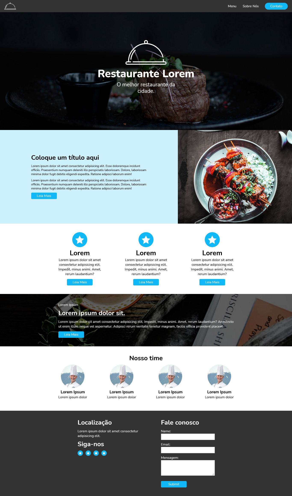

<br />
<p align="center">
 
   

  <h1 align="center">Restaurant Template</h1>

</p>

# Objective
This is a template focused on restaurants websites design, to be easy of modify in seviral similar projects.

# Demo
Access the <a href="#" target="_blank">demonstration</a> of the product.

# Download
```bash
$ git clone https://github.com/GustavoDias7/restaurant-template.git
$ cd restaurant-template
$ start index.html
```

# Status
Not finished.

# Font Family
Nunito (Google Fonts)

# Font Size
h1 = 40px <br>
h2 = 30px <br>
h3 = 1rem <br>
p (main-subtitle) = 25px <br>
p (long-para) = 14px <br>
p (general-para) = 1rem <br>
a (general-link) = 1rem <br>
button (general-button) = 12px <br>
label = 1rem <br>
input = 1rem <br>

# Color
blue = #11b9f8 <br>
hover blue = #3bcbff <br>
background blue = #2bc6ff <br>
grey = #333333 <br>
white = #ffffff <br>

# Meus Contatos
- <a href="https://www.linkedin.com/in/gustavo-dias-3100211b6/">Linkedin</a>
- <a href="https://www.instagram.com/eu.gustavodias/">Instagram</a>